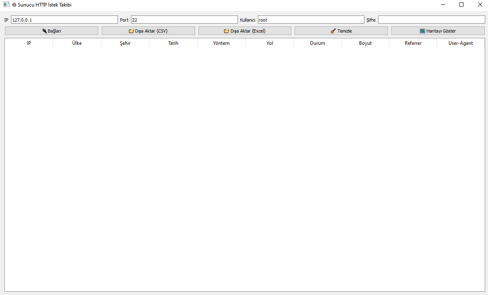

🌐 Server HTTP Log Tracker

> Gerçek zamanlı SSH üzerinden sunucu HTTP erişim loglarını takip eden, coğrafi konum bilgisi ve harita gösterimi ile zenginleştirilmiş modern PyQt5 tabanlı masaüstü uygulama.

---

🚀 Özellikler

- 🔌 SSH ile uzaktaki Nginx/Apache access log dosyasına bağlanma  
- 📜 Canlı olarak son log satırlarını çekme ve tablo halinde gösterme  
- 🌍 IP adreslerinin ülke, şehir ve koordinat bilgilerini IP-API servisi üzerinden alma  
- 🗺️ Folium ile IP lokasyonlarını haritada işaretleme  
- 📁 Verileri CSV ve Excel dosyalarına kolayca dışa aktarma  
- 🧹 Tablo ve harita temizleme  
- 🔔 Bağlantı durumu ve hata mesajları kullanıcıya bildirilir  
- 🖥️ Modern, sezgisel PyQt5 arayüz  
- 🎵 Sesli uyarı eklemek kolaydır (PyQt5.QtMultimedia hazır)  

---

📦 Kurulum

1. Depoyu klonlayın:

   git clone https://github.com/ebubekirbastama/server-http-log-tracker.git
   cd server-http-log-tracker

2. Sanal ortam oluşturun ve etkinleştirin (isteğe bağlı):

   python -m venv venv
   source venv/bin/activate  # macOS/Linux
   venv\Scripts\activate     # Windows

3. Gerekli paketleri yükleyin:

   pip install -r requirements.txt

   > Gerekli paketler:  
   > paramiko, requests, folium, pandas, PyQt5

---

⚙️ Kullanım

python log_viewer.py

- SSH bağlantı bilgilerini (IP, port, kullanıcı, şifre) girin  
- Bağlan düğmesine tıklayın  
- Son 10 log satırı otomatik olarak her 3 saniyede yenilenecek  
- Harita butonuyla IP lokasyonlarını harita üzerinde görüntüleyebilirsiniz  
- Verileri CSV veya Excel olarak dışa aktarabilirsiniz  

---

🛠️ Teknolojiler

- Python 3  
- PyQt5 (GUI)  
- Paramiko (SSH)  
- Requests (HTTP API çağrıları)  
- Folium (Harita gösterimi)  
- Pandas (Veri işleme ve dışa aktarım)  

---

📈 Geliştirme ve Katkı

Bu proje açık kaynaklıdır, katkılarınızı bekliyoruz!  
Yeni özellik önerileri, hata raporları için lütfen issue açınız.

---

📜 Lisans

MIT License © Ebubekir Bastama

---

📸 Ekran Görüntüsü

---

İletişim

💬 Twitter: https://twitter.com/ebubekirstt  

---

Teşekkürler! 🙌
